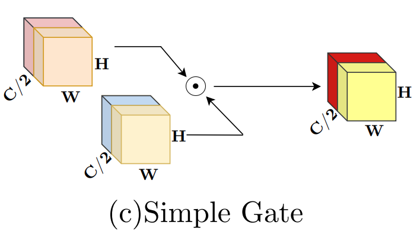
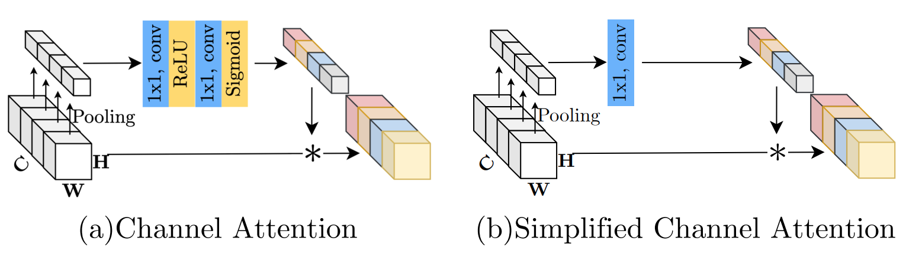
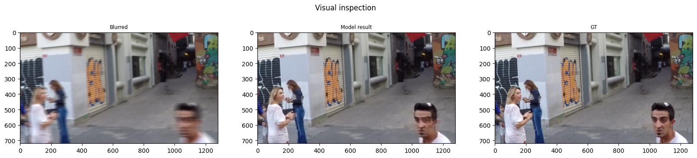

# NAFNet - Image Deblurring

This repository contains my implementation and exprimentation for single-image deblurring on the GoPro dataset. The project progresses from a lightweight residual CNN baseline to a generalized UNet architecture, culminating in a simplified **NAFNet** implementation.

## Overview

The implementation explores modern CNN architectures for image restoration, with a focus on the NAFNet architecture which achieved state-of-the-art performance in image deblurring despite being presented as a baseline model.

### Architectural Evolution

- **Residual Baseline**: A compact convolutional stack that predicts residuals $f_\theta(x)$ using the formulation $\hat{y} = x + f_\theta(x)$
- **Generalized UNet**: Modular down/upsampling blocks with skip connections
- **NAFNet**: Implements modern design choices including SimpleGate nonlinearity, simplified channel attention (SCA), LayerNorm2d, and pixelshuffle upsampling

## Key Features

### NAFNet Design Innovations

[NAFNet](https://arxiv.org/abs/2204.04676) introduces several architectural improvements over traditional UNet-based approaches:

- **Nonlinearity Replacement**: Eliminates traditional activation functions (ReLU, GELU, ELU) in favor of gating mechanisms
- **Simplified Channel Attention**: Streamlined attention mechanism without MLP overhead
- **Normalization Update**: Replaces BatchNorm with LayerNorm
- **Transformer-inspired Training**: Incorporates techniques from modern transformer literature

This approach shares philosophical similarities with [ConvNeXt](https://arxiv.org/abs/2201.03545), which refined ResNet using contemporary training strategies to achieve breakthrough performance.

### Simple Gate Block

Instead of conventional nonlinearities, NAFNet employs "Simple Gates" that perform pointwise multiplication of feature maps. The input is split along the channel axis using [`torch.chunk`](https://pytorch.org/docs/stable/generated/torch.chunk.html) and the resulting halves are multiplied element-wise.



### Simplified Channel Attention

Traditional channel attention mechanisms use 2-layer MLPs to produce channel weights. NAFNet simplifies this by:
- Applying global average pooling to feature maps
- Using direct linear projection instead of MLP
- Maintaining effectiveness while reducing computational complexity



## Results

The implementation achieves competitive performance with approximately 30 dB PSNR on the GoPro test set. The NAFNet architecture demonstrates significant improvements in image clarity and detail preservation compared to the input blurry images.

Qualitative Comparison

Here is an example showing the deblurring results across different architectures:



From left to right:

Blurry Input: Original degraded image from the GoPro dataset <br>
NAFNet: Final output from my simplified NAFNet architecture <br>
The Ground truth <br>

## Environment Setup

- Python 3.10+
- PyTorch, torchvision
- albumentations, Pillow
- tqdm, numpy, matplotlib

Install dependencies:
```bash
pip install -r requirements.txt
```

## Dataset

The project uses the **GoPro** deblurring dataset organized in the following structure:
```
./GoPro/
├── train/
│   ├── blur/*.png
│   └── sharp/*.png
└── test/
    ├── blur/*.png
    └── sharp/*.png
```

The notebook includes automated download functionality for:
- `GoPro.zip` (~5.2 GB) from Yandex Disk mirror

## Usage

Execute the main notebook:
```
deblurring_task_clean.ipynb
```

The notebook contains complete training pipelines for all three architectures (baseline, UNet, NAFNet) with:
- Gradient clipping
- Learning rate scheduling
- Model visualization
- Quality assessment via `utils.test_model`

## Metrics

Primary optimization metric: **PSNR loss** (negative log form of MSE), where more negative values correspond to higher PSNR.

## Repository Structure

```
.
.
├── README.md
├── requirements.txt
├── debluring_Nafnet.ipynb
├── utils.py
├── GoPro/
│   ├── train/
│   │   ├── blur/*.png
│   │   └── sharp/*.png
│   └── test/
│       ├── blur/*.png
│       └── sharp/*.png
├── images/
│   ├── blur.png
│   ├── unet.png
│   ├── gate.png
│   └── sca.png
├── results/
│   ├── nafnet.png
│   ├── simple_baseline.png
│   └── unet.png

```

## References

1. Dong et al., **Learning a Deep Convolutional Network for Image Super-Resolution**, ECCV 2014. [arXiv:1501.00092](https://arxiv.org/abs/1501.00092)
2. Zhang et al., **DnCNN: Beyond a Gaussian Denoiser**, TIP 2017. [arXiv:1608.03981](https://arxiv.org/abs/1608.03981)
3. Ronneberger et al., **U-Net: Convolutional Networks for Biomedical Image Segmentation**, MICCAI 2015. [arXiv:1505.04597](https://arxiv.org/abs/1505.04597)
4. Chen et al., **Simple Baselines for Image Restoration (NAFNet)**, ECCV 2022. [arXiv:2204.04676](https://arxiv.org/abs/2204.04676)
5. Liu et al., **A ConvNet for the 2020s (ConvNeXt)**, CVPR 2022. [arXiv:2201.03545](https://arxiv.org/abs/2201.03545)

---

*Note: This implementation focuses on the core architectural innovations of NAFNet while maintaining computational efficiency and training stability.*


